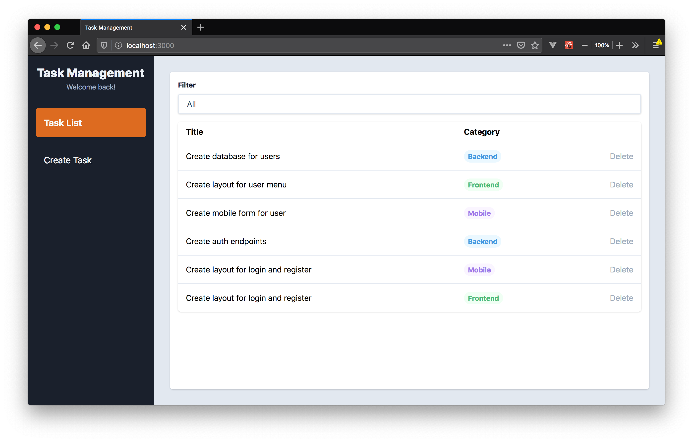
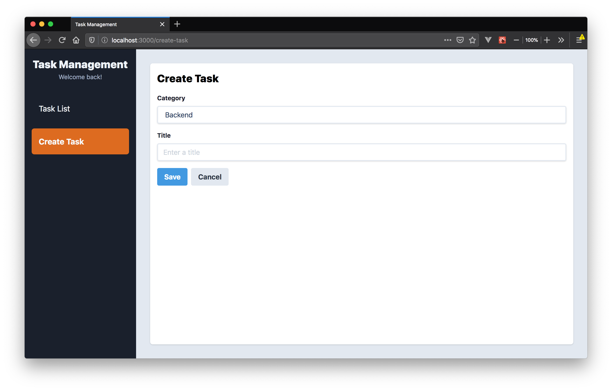
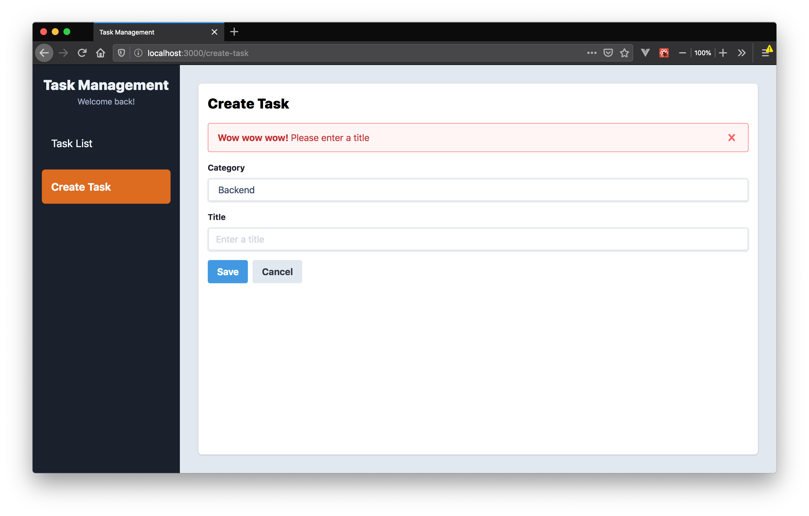
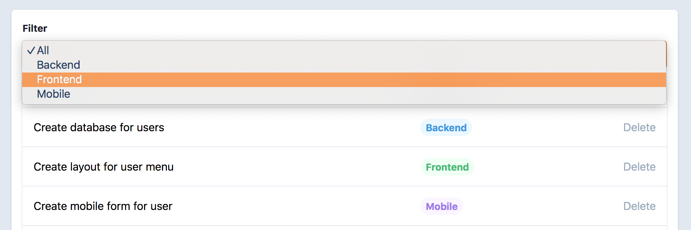

# Task Management App

## Summary

Buatlah aplikasi Task Management menggunakan React. Dalam aplikasi ini, terdapat
tiga kategori task yaitu: `Backend`, `Frontend` dan `Mobile`. User bisa melihat
task apa saja yang ada berdasarkan kategori yang dipilih. Silakan menggunakan
`json-server` untuk menyingkat waktu!

Skema dari task adalah sebagai berikut:
```json
{
  "id": 1,
  "title": "",
  "category": ""
}
```

Pada app kamu nanti, simpanlah tasks di Redux!

## Competencies

- React
- React Router
- Redux

## Release 0

Buatlah sebuah halaman dengan path `/` yang menampilkan semua data task. Di
setiap item-nya, tambahkan button `Delete`.



## Release 1

Buatlah sebuah halaman dengan path `/create-task` yang berisi form untuk
menambahkan task. Data yang bisa di-input oleh user adalah `Category` dan
`Title`.



## Release 2
Tambahkan validation yang mengharuskan user mengisi `Title` saat create task.



## Release 3
Tambahkan fitur untuk melakukan filter di path `/` agar user bisa melihat data
dari kategori yang dipilih.



## Release 4

Implementasikan `Delete` button untuk menghapus task di path `/`.
